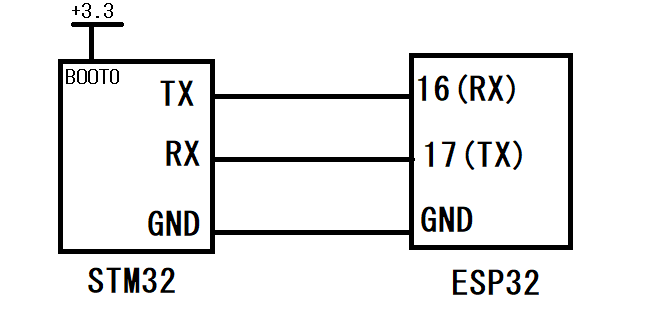

# ESP32 bluetooth programmer of STM32 MCUs

Thanks to this program, you can flash STM32 microcontrollers wirelessly through bluetooth! 

## Connections

Every STM32 microcontroller has its own defined RX/TX pins and in order to use the default UART bootloader present in all STM32 microcontrollers, you need to find those two pins. For that, refer to the [AN2606 document](https://www.st.com/resource/en/application_note/cd00167594-stm32-microcontroller-system-memory-boot-mode-stmicroelectronics.pdf), find your microcontroller type in the list of contents and look at the second table for the bootloader-supported UART pins. For example if my MCU is STM32F407xx, on page 126 of the aforementioned document I can see that I can use PA9/PA10,  PB10/PB11, or PC10/PC11 as the TX/RX pins. Then connect them to the pins 16 and 17 of the ESP32. (These can be changed via the RX_PIN and TX_PIN macros on lines 39 and 40 of the code)

Also you need to set the BOOT1 and BOOT0 to 1 on your MCU in order to boot into bootloader mode. In most microcontroller those two are pins, but in some STM32 MCUs one of those is offered as an option bit, in this case make sure to set that bit as 1 and pull up BOOT0 by hand, then reset the board.



## Companion Python script
I have written a python script in order to send the hex file to the ESP32 via bluetooth. You can find the "senddata.py" file in the root directory of this project. This is how it should be used:
```bash
> python senddata.py -d "path/to/hexfile.hex" -p COM18
```  
Pass the .hex file with the -d flag and the virtual bluetooth COM port with the -p flag. After you pair with the ESP32, 2 new COM ports are added to the device manager, find the correct one and pass it as an argument.

The data file should be in Intel Hex format, Keil uVision generates a .hex file everytime  you compile your code, you can pass the path to that .hex file to this python script.
## Usage Example

```bash
> python senddata.py -d "blinky.hex" -p COM18

Erasing all flash sectors...
Flash erase successful
1/2 done
2/2 done
Successfully Flashed. Reset the board with BOOT0=0 to run
```
If it is stuck on the "Erasing all flash sectors..." step for more than 30 seconds, perhaps it wasn't able to communicate with STM32's UART bootloader. It's recommended to unplug and replug power to the STM32 and make sure than BOOT1 and BOOT0 pin/option bytes are both 1, also run the python code again.

## Tested on
- [x] STM32F4Discovery
- [x] STM32F3Discovery

## License

[GPL2](https://choosealicense.com/licenses/gpl-2.0/)